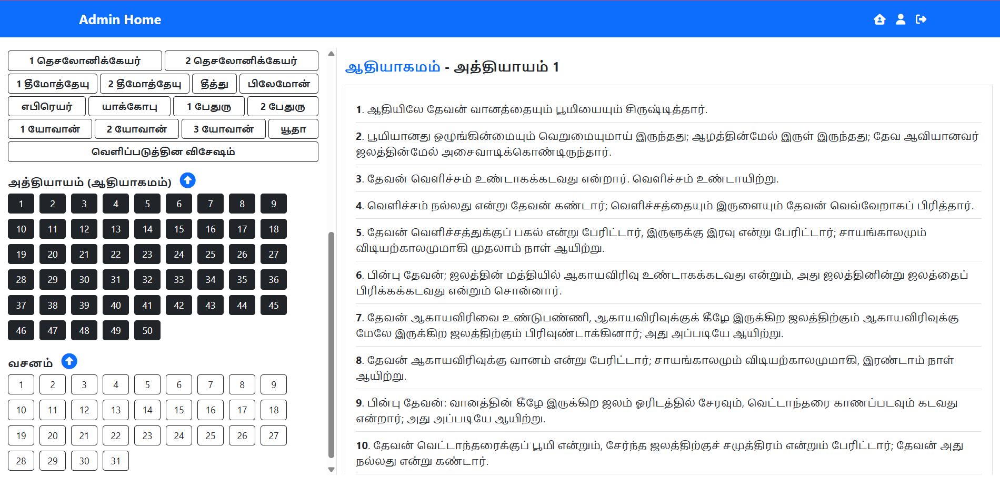

# BibleVerse

**BibleVerse** is a Laravel-based Bible web app to read, search, and view Bible verses in **Tamil and English**.  
It’s designed for use by **individuals and churches**, with features like AJAX-based navigation, clean UI, and verse projection view.



---

## 🌟 Features

- 📖 View Bible verses by selecting Book → Chapter → Verse (AJAX-powered)
- 🔍 Advanced Search and Filter
- 🌐 Supports both Tamil and English
- 🎬 Clean single-verse display for church projection
- 📱 Mobile-friendly responsive design

---

## 🚧 Upcoming Features

- 🔊 Audio Bible — play audio when clicking a verse
- 🎵 Christian Songs Lyrics page
- 🌍 Multilingual support (Hindi, Malayalam, Kannada, Telugu, etc.)
- 👥 User accounts & bookmarking (future)

---

## 🛠️ Tech Stack

- Laravel
- MySQL
- jQuery / AJAX
- Blade Templates
- Bootstrap 5

---

## 🤝 Contributing

Contributions are welcome!

1. Fork the repo
2. Create a feature branch: `git checkout -b my-feature`
3. Commit your changes: `git commit -m 'Add feature'`
4. Push to the branch: `git push origin my-feature`
5. Open a pull request

---

## 💻 Live Demo / Hosting Guide

🔗 **Live Demo:** [https://bible.yaabitech.com](https://bible.yaabitech.com)

📦 **Hosting Guide:**
- 🖥️ Local PC (XAMPP/WAMP): Coming soon
- 🌐 Shared Hosting: Coming soon
- ☁️ AWS EC2: Coming soon

---

## 🧑‍💻 Author

- **Nishanth Prabu**
- [Portfolio](https://nishanthprabu.com)
- [LinkedIn](https://www.linkedin.com/in/nishanth-prabu/)
- [YouTube Tutorials](https://youtube.com/@yaabiacademy)

---

## 🪪 License

[MIT License](LICENSE)

---

## 📝 Acknowledgements

- Open source Bible data
- Laravel Community

---

## 🚀 Installation

```bash
git clone https://github.com/NishanthCodeX/BibleVerse.git
cd BibleVerse
composer install
cp .env.example .env
php artisan key:generate

# Edit the .env file:
# By default, this project uses SQLite for easy setup.
# To use MySQL instead, update the DB_CONNECTION and related DB_* values in .env

php artisan migrate --seed
php artisan serve  # Or run it via XAMPP/WAMP's Apache server with the correct document root
